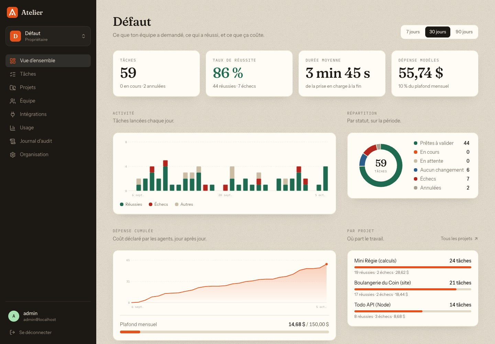
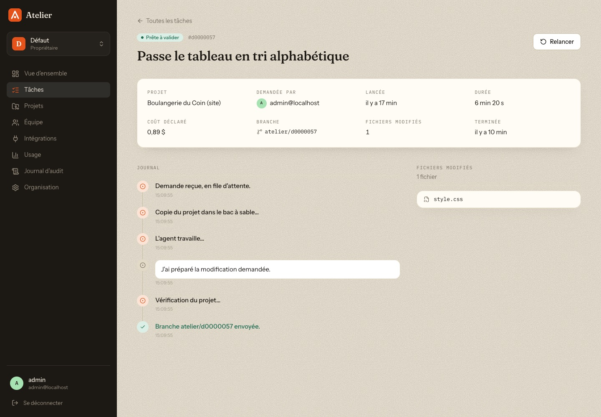
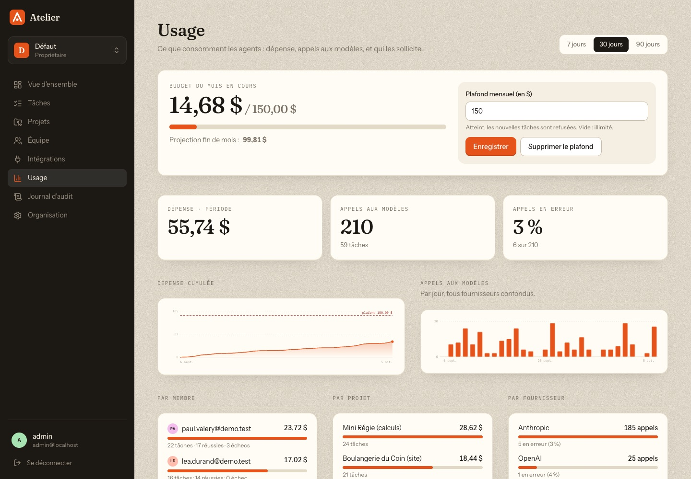
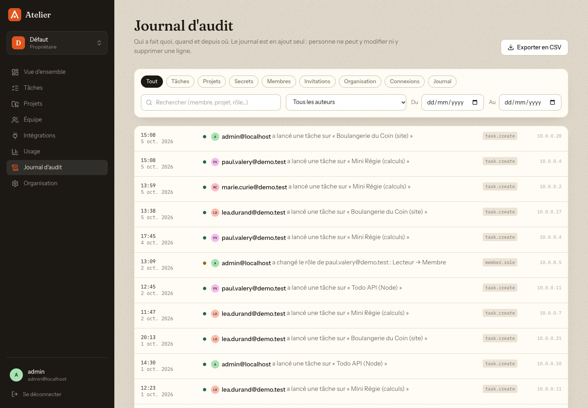

# Atelier

**Let non-developers evolve their software by talking to an AI agent — without installing anything, and without being able to break production.**

A teammate writes *"add a volume discount to the Travel tab"*. An AI agent edits the code **inside a disposable Docker sandbox**. The platform runs the project's checks, then opens a **merge request / pull request**. A human reviews and merges.

<p align="center">
  
</p>

<table>
  <tr>
    <td><a href="docs/img/app-overview.jpg"></a></td>
    <td><a href="docs/img/app-task.jpg"></a></td>
  </tr>
  <tr>
    <td><a href="docs/img/app-usage.jpg"></a></td>
    <td><a href="docs/img/app-audit.jpg"></a></td>
  </tr>
</table>

## The idea in four lines

- **The agent never holds a power it could abuse.** Git tokens, model API keys, pushing and merging all live in the orchestrator — plain code the agent cannot change.
- **The sandbox is disposable and blind.** One container per task, no secret, no Internet; its only way out is a proxy that adds the real API key.
- **Nothing ships without a human.** The agent only ever produces a merge/pull request.
- **Teams are isolated.** Organizations, roles, per-organization encrypted secrets and projects.

## Quick start

You need Docker. No API key and no Git server are required to try it: a deterministic fake agent and three fake projects stand in for both.

```bash
git clone <this repository> atelier && cd atelier
./scripts/demo.sh        # http://localhost:8080 — e-mail admin@localhost, password demo
                         # (seeded with 45 days of history, five members and charts to look at)
```

Ask for anything. A request containing the word **"casse"** makes the project's check fail so you can watch the agent get re-run with the error and fix it.

To run it for real (your own projects, a real model, a real forge), see **[Deployment](docs/deployment.md)** and **[Configuration](docs/configuration.md)**.

## Status

| | |
|---|---|
| Pipeline: clone → sandboxed agent → check → fix loop → branch → MR/PR | ✅ working, tested end to end with the fake agent |
| Accounts, sessions, organizations, roles, per-organization isolation | ✅ working, covered by an isolation test suite |
| Encrypted secrets, projects in the database, per-organization model keys and monthly budget | ✅ working |
| **Real Claude agent**, **real GitLab MR**, **real GitHub PR** | ⚠️ implemented, **not yet exercised** (no key or forge in the dev environment) |
| A full web application: overview, tasks, projects, team, integrations, usage, audit log, organization and account pages (light and dark, phone-ready) | ✅ working, driven in a real browser by the smoke test |
| Organizations, members, invitations, projects, secrets, budget, audit log, sessions | ✅ working, API and UI |
| SSO (OIDC, GitLab / GitHub sign-in), real-agent validation, previews, audit log | 🚧 next ([roadmap](docs/roadmap.md)) |

Read **[Security → known limitations](docs/security.md#known-limitations)** before exposing it to anyone.

## Documentation

| Document | What's in it |
|---|---|
| [Architecture](docs/architecture.md) | Components, the life of a task, repository layout |
| [Security](docs/security.md) | Trust boundaries, authorization, secrets handling, known limitations |
| [Multi-tenancy](docs/multi-tenancy.md) | Organizations, roles, data model, API, implementation steps |
| [Configuration](docs/configuration.md) | Environment variables, projects, git forges, model providers |
| [Deployment](docs/deployment.md) | Docker, Portainer, reverse proxy, backups |
| [Testing](docs/testing.md) | How to run the checks, what is and is not covered |
| [Roadmap](docs/roadmap.md) | Milestones and the path to a multi-tenant SaaS |
| [Web application design](docs/ui-design.md) | The full SaaS interface: pages, stack, backend additions, phases |

Contributing with an AI assistant or by hand? Start with **[CLAUDE.md](CLAUDE.md)**.

## License

MIT — see [LICENSE](LICENSE).
