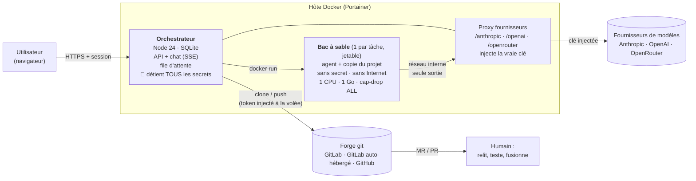
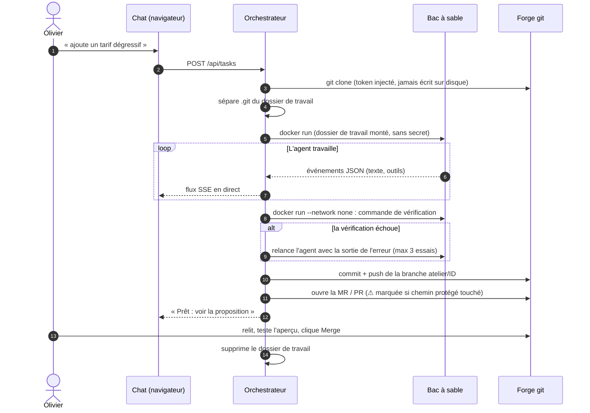
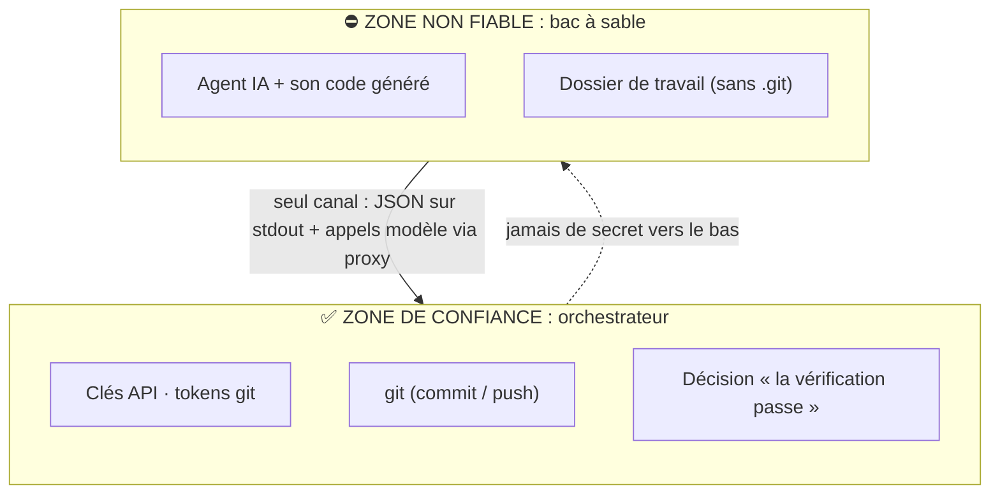
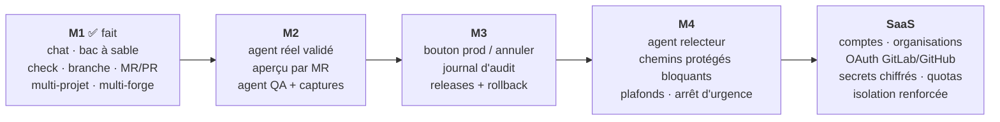

# Atelier

**Une plateforme où des personnes non techniques font évoluer leur logiciel en parlant à un agent IA — sans installer quoi que ce soit, et sans pouvoir casser la production.**

On écrit en français « ajoute un tarif dégressif sur l'onglet Voyage ». Un agent IA modifie le code **dans un bac à sable Docker jetable**. La plateforme vérifie, puis ouvre une **merge request / pull request**. Un humain valide et fusionne.

> **État : M1 + comptes, sessions, organisations (U1–U3)** — le pipeline complet fonctionne et est testé de bout en bout avec un *agent factice, sans IA* (`scripts/smoke.sh`).
> **Pas encore testés en conditions réelles :** l'agent Claude réel, une vraie MR GitLab, une vraie PR GitHub.
> Essayer tout de suite, sans clé ni forge : [`./scripts/demo.sh`](#démo-sans-ia).
> Voir [Ce qui est testé](#ce-qui-est-testé) et la [feuille de route](#feuille-de-route).

---

## Sommaire

1. [Principe de sécurité](#principe-de-sécurité)
2. [Architecture](#architecture)
3. [Cycle de vie d'une tâche](#cycle-de-vie-dune-tâche)
4. [Frontières de confiance](#frontières-de-confiance)
5. [Démarrer](#démarrer) · [Déployer avec Portainer](#déployer-avec-portainer)
6. [Configuration](#configuration)
7. [Forges git, fournisseurs de modèles, projets](#forges-git-fournisseurs-de-modèles-projets)
8. [Sécurité : limites connues](#sécurité--limites-connues)
9. [Feuille de route](#feuille-de-route)
10. [Structure du dépôt](#structure-du-dépôt)

---

## Principe de sécurité

**L'agent ne détient jamais aucun pouvoir dangereux.** Tout ce qui est sensible (clés des modèles, token git, push, MR, déploiement) vit dans l'**orchestrateur**, du code déterministe que l'agent ne peut pas modifier. L'agent n'a que ce qu'il faut pour éditer des fichiers dans son conteneur.

| L'agent peut… | L'agent ne peut pas… |
|---|---|
| lire et modifier les fichiers du projet (copie jetable) | voir un token git, une clé API, un secret de production |
| exécuter des commandes *dans son conteneur* | accéder à Internet (réseau interne sans sortie) |
| parler au modèle via le proxy de l'orchestrateur | pousser, fusionner, déployer |
| | toucher au dossier `.git` (il est hors de sa vue) |

## Architecture



Deux réseaux Docker :
- `default` — l'orchestrateur a accès à Internet (git, modèles).
- `atelier-sandbox` (**`internal: true`**) — les bacs à sable n'y voient **que** le proxy de l'orchestrateur.

## Cycle de vie d'une tâche



## Frontières de confiance



Choix de conception qui en découlent (chacun est un point d'attaque évité) :

- **`.git` hors du dossier monté.** Un `.git/config` ou un hook piégé écrit par l'agent aurait été exécuté par *notre* git, qui porte le token. Le dépôt est cloné avec `--separate-git-dir`, le `.git` visible est supprimé, et git est toujours appelé avec `--git-dir/--work-tree` explicites, `core.hooksPath=/dev/null` et `core.fsmonitor=false`.
- **Token jamais sur disque ni en argument.** Il passe par `GIT_CONFIG_*` (variables d'environnement), pas par l'URL du remote ni par `.git/config`.
- **L'orchestrateur lance lui-même la vérification**, sans réseau et hors de l'agent. On ne croit pas l'agent sur parole quand il dit « les tests passent ».
- **Clés de modèles dans un proxy.** Le bac à sable reçoit une clé factice ; le proxy n'autorise que les routes de génération et ajoute la vraie clé.
- **Chemins protégés.** Si le diff touche `protectedPaths` (migrations, CI…), la MR est titrée `[REVUE REQUISE]` et le signale dans sa description.

## Démarrer

Prérequis : Docker.

```bash
cp .env.example .env        # puis édite : mot de passe, clé(s) API, token git, projets
mkdir -p /srv/atelier/work  # ou un chemin de ton choix, à mettre dans ATELIER_WORKDIR
docker compose up -d --build
open http://localhost:8080  # e-mail : ATELIER_BOOTSTRAP_EMAIL · mot de passe : ATELIER_PASSWORD
```

Vérifier que la chaîne fonctionne **sans clé, sans IA et sans forge** :

```bash
./scripts/smoke.sh          # doit finir par « SMOKE OK »
```

### Démo sans IA

Trois faux projets (`fixtures/projects/` : un site statique, une petite API Node, un module de calcul avec son test) et un **agent factice déterministe** : aucun modèle n'est appelé, rien ne coûte, tout est reproductible.

```bash
./scripts/demo.sh           # http://localhost:8080 — e-mail : admin@localhost · mot de passe : demo
```

| Tu écris… | L'agent factice… | Tu observes |
|---|---|---|
| une demande quelconque | ajoute une ligne à `NOTES.md` | tâche terminée, branche `atelier/<id>` poussée dans le faux dépôt |
| une demande contenant **« casse »** | écrit un fichier invalide en plus | la vérification **échoue**, l'agent est relancé avec l'erreur, il corrige, la tâche se termine (boucle de correction) |

Les « forges » de la démo sont des dépôts git locaux (`.demo/fixtures/*.git`) : `git --git-dir=.demo/fixtures/mini-regie.git branch` montre les branches créées.

### Déployer avec Portainer

1. *Stacks → Add stack → Repository* : URL de ce dépôt, fichier `docker-compose.yml`.
2. *Environment variables* : les variables de [`.env.example`](.env.example).
3. Créer le dossier `ATELIER_WORKDIR` sur l'hôte (ex. `/srv/atelier/work`).
4. *Deploy the stack*. Le service `sandbox-image` construit l'image du bac à sable puis s'arrête (normal).
5. Mettre un reverse proxy HTTPS devant le port 8080 : l'authentification Basic ne doit **pas** circuler en clair.

## Configuration

| Variable | Rôle |
|---|---|
| `ATELIER_PASSWORD` | Mot de passe **initial** du compte propriétaire (**obligatoire**, à changer dans l'interface) |
| `ATELIER_BOOTSTRAP_EMAIL` | E-mail du propriétaire créé au premier démarrage (défaut `admin@localhost`) |
| `TRUST_PROXY` · `COOKIE_SECURE` | `1` derrière un reverse proxy HTTPS : lit l'IP/le schéma réels, cookie `Secure` |
| `ANTHROPIC_API_KEY` · `OPENAI_API_KEY` · `OPENROUTER_API_KEY` | Clés des fournisseurs (au moins une) |
| `GIT_TOKEN` | Token git par défaut (GitLab : `api` + `write_repository` ; GitHub : `repo`) |
| `PROJECTS_JSON` / `/data/projects.json` | Liste des projets (voir ci-dessous) |
| `ATELIER_WORKDIR` | Dossier de travail temporaire, **même chemin hôte et conteneur** |
| `MAX_BUDGET_USD` · `AGENT_TIMEOUT_S` · `MAX_ATTEMPTS` | Plafonds par tâche (2 $ · 900 s · 3 essais) |

## Forges git, fournisseurs de modèles, projets

**Forges** — se déduisent de l'URL du dépôt, ou se forcent avec `"forge"` :

| Forge | `repo` | Création de la MR / PR |
|---|---|---|
| GitLab.com | `https://gitlab.com/groupe/projet.git` | API v4 |
| **GitLab auto-hébergé** | `https://gitlab.mon-domaine.fr/groupe/projet.git` | API v4 sur le même domaine |
| GitHub.com | `https://github.com/org/repo.git` | API GitHub |
| GitHub Enterprise | `https://ghe.mon-domaine.fr/org/repo.git` (`"forge":"github"`) | `/api/v3` |
| Sans forge | chemin local, `"forge":"none"` | pousse seulement la branche |

**Multi-projet** — `projects.json` est une liste, relue à chaque requête (ajouter un projet ne demande pas de redémarrage). Chaque projet a sa branche de base, sa commande `check`, ses `protectedPaths` et son propre token (`tokenEnv`, utile pour plusieurs forges). Voir [`projects.example.json`](projects.example.json).

**Multi-fournisseur** — le proxy route par préfixe (`/anthropic`, `/openai`, `/openrouter`) ; ajouter un fournisseur = une entrée dans `PROVIDERS` (`orchestrator/src/proxy.ts`). Côté agent, le champ `engine` choisit le moteur dans le bac à sable. **Seul `claude` (Claude Agent SDK) est implémenté.** Pour les autres modèles, brancher un moteur compatible multi-fournisseur (OpenCode, Codex CLI…) dans `sandbox/runner.mjs` : il doit seulement émettre les mêmes événements JSON.

## Sécurité : limites connues

À lire avant d'exposer l'outil.

- **Le socket Docker monté dans l'orchestrateur équivaut à root sur l'hôte.** Acceptable pour une équipe de confiance sur un serveur dédié ; **inacceptable pour du multi-locataire** (voir feuille de route). Atténuation possible : un proxy de socket filtrant (ex. `docker-socket-proxy`).
- **Tâches cloisonnées par organisation, projets pas encore** : les projets viennent de la configuration et sont communs à toutes les organisations jusqu'à l'étape U4. Il n'y a pas encore d'invitation ni de création d'organisation par l'API (U6) : seule l'organisation « Défaut » existe. Ne l'expose pas sans HTTPS.
- **Limitation des tentatives en mémoire** : elle se vide au redémarrage et ne fonctionne pas entre plusieurs instances.
- **Le bac à sable n'a pas Internet** : l'agent ne peut pas `npm install`. Les projets avec dépendances demandent une image préparée ou un proxy de registre (non fait).
- **L'image du bac à sable ne contient que Node.** Les `check` doivent s'en contenter.
- **Pas de comptage de budget par tâche dans le proxy.** Plafonne les clés côté console du fournisseur ; `maxBudgetUsd` borne la session côté agent.
- **Une tâche à la fois** (file d'attente simple).
- Isolation = conteneur durci (`cap-drop ALL`, `no-new-privileges`, limites CPU/RAM/PID, utilisateur non root). Ce n'est **pas** une isolation de type machine virtuelle.

## Ce qui est testé

| Élément | Statut |
|---|---|
| Clone → bac à sable → vérification → commit → push → nettoyage | ✅ `scripts/smoke.sh` (agent factice, dépôts locaux) |
| API refusée sans authentification (401) | ✅ `scripts/smoke.sh` |
| Boucle de correction après échec de `check` | ✅ `scripts/smoke.sh` (échec puis réparation, le changement valide est conservé) |
| Plusieurs projets, chacun avec sa propre commande de vérification | ✅ `scripts/smoke.sh` (`mini-regie`, `todo-api`) |
| Vérification de types de l'orchestrateur | ✅ `npm run check` |
| Hachage scrypt, création du propriétaire, e-mail normalisé | ✅ `npm test` (dans `orchestrator/`) |
| Sessions : expiration glissante, jeton stocké haché, révocation, cookie `HttpOnly`/`SameSite=Strict` | ✅ `npm test` |
| **Isolation entre organisations** : 404 sur tout ce qui est étranger (liste, tâche, flux, annulation, création), identifiant forgé refusé, rôles lecteur/membre/admin appliqués | ✅ `npm test` (`isolation.test.ts`, vrai serveur HTTP) |
| Login, CSRF inter-origines (403), changement de mot de passe, déconnexion, limitation (429) | ✅ `scripts/smoke.sh` |
| Interface de connexion dans un vrai navigateur | ⚠️ script de la page vérifié syntaxiquement, non essayé à l'écran |
| Agent Claude réel dans le bac à sable (proxy + SDK) | ⚠️ non testé (pas de clé dans cet environnement) |
| MR GitLab réelle, PR GitHub réelle | ⚠️ non testé |
| Annulation (`/cancel`) | ⚠️ écrite, non exercée |

## Feuille de route



### Vers une vraie plateforme SaaS (multi-utilisateur, multi-organisation)

> 📐 **Conception détaillée : [`docs/MULTI-USER.md`](docs/MULTI-USER.md)** (modèle de données, rôles, points de sécurité, étapes U1 à U6).

Ce n'est pas une extension de M1 : **le modèle de menace change**. On n'exécute plus le code d'une équipe de confiance, mais celui de locataires qui ne se connaissent pas.

| Sujet | Aujourd'hui (M1) | Cible SaaS |
|---|---|---|
| Authentification | Comptes locaux + sessions ✅ | + SSO (OIDC), « se connecter avec GitLab / GitHub » |
| Locataires | Organisations, rôles et tâches cloisonnées ✅ (projets/secrets : U4) | chaque tâche, projet, secret et journal appartient à une organisation |
| Connexion git | token collé dans la config | **OAuth / GitHub App / GitLab OAuth** par organisation, droits minimaux, révocables |
| Secrets (clés de modèles, tokens) | variables d'environnement | Stockés **chiffrés** en base, par organisation, « apportez votre clé » ou clé plateforme refacturée |
| Base | SQLite | PostgreSQL |
| Exécution | Docker via socket monté | **gVisor / Firecracker**, un orchestrateur de bacs à sable sans socket Docker, sur des machines dédiées aux agents |
| Réseau des agents | réseau interne + proxy | idem + règles de sortie **par organisation**, registre de paquets mis en cache |
| Coûts | plafond par tâche | Quotas et facturation par organisation, comptage de tokens dans le proxy |
| Concurrence | 1 tâche à la fois | Pool de workers, files par organisation, équité |
| Traçabilité | événements par tâche | Journal d'audit immuable (qui a demandé, quel diff, qui a fusionné) |

Les points déjà alignés avec cette cible : les secrets sont déjà isolés de l'agent (proxy), la forge est abstraite, les projets sont des données et non du code, et l'orchestrateur est la seule zone de confiance.

## Structure du dépôt

```
atelier/
├── docker-compose.yml          Stack Portainer (orchestrateur + image du bac à sable)
├── docker-compose.fixtures.yml Ajout pour la démo et le test (monte les faux dépôts git locaux)
├── docs/MULTI-USER.md          Conception du multi-utilisateur / multi-organisation
├── fixtures/                   Faux projets + leur liste (démo et tests, sans IA)
├── .env.example · projects.example.json
├── orchestrator/               Node 24, TypeScript exécuté sans build, 0 dépendance d'exécution
│   ├── src/index.ts            API HTTP + auth + flux SSE
│   ├── src/pipeline.ts         cycle d'une tâche : clone → agent → check → push → MR/PR
│   ├── src/git.ts              git durci + création MR/PR (GitLab, GitHub)
│   ├── src/sandbox.ts          lance l'agent / la vérification dans Docker
│   ├── src/proxy.ts            proxy fournisseurs de modèles (injecte les clés)
│   ├── src/db.ts               SQLite : tâches, événements, utilisateurs, organisations
│   ├── src/auth.ts             hachage de mots de passe (scrypt)
│   ├── src/app.ts              serveur HTTP : routes, cloisonnement par organisation (`index.ts` ne fait que démarrer)
│   ├── src/access.ts           table des droits par rôle
│   ├── src/session.ts          sessions par cookie (jeton haché, expiration glissante)
│   ├── src/ratelimit.ts        limitation des échecs de connexion
│   ├── src/bootstrap.ts        création du compte propriétaire au premier démarrage
│   ├── src/config.ts           variables d'environnement + projets
│   └── public/index.html       interface de chat (une page, sans build)
├── sandbox/
│   ├── Dockerfile              Node + ripgrep, utilisateur non root
│   └── runner.mjs              lance le Claude Agent SDK (ou l'agent factice), émet des événements JSON
└── scripts/
    ├── smoke.sh                test de bout en bout (agent factice, sans clé API)
    ├── demo.sh                 démo locale avec 3 faux projets
    └── fixtures.sh             fabrique les faux dépôts git locaux
```

## Licence

MIT — voir [LICENSE](LICENSE).
