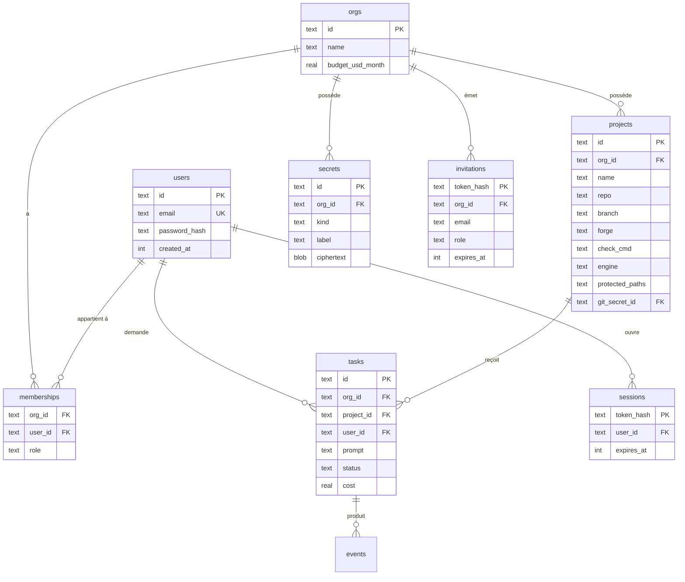

# Conception : multi-utilisateur et organisations

Statut : **U1 à U3 faites** (comptes, sessions, rôles, tâches cloisonnées par organisation). U4 à U6 : à faire. Les **projets** restent communs à toutes les organisations (config JSON) jusqu'à U4, et il n'existe pas encore d'API pour créer une organisation ou inviter quelqu'un (U6) : seule l'organisation « Défaut » existe en pratique.
Principe directeur : *le plus petit changement qui rend la plateforme sûre pour plusieurs personnes de plusieurs équipes*. Le SaaS public (facturation, SSO d'entreprise, isolation par microVM) est hors de ce document — voir la [feuille de route du README](../README.md#feuille-de-route).

## 1. Ce qu'on vise

Plusieurs **utilisateurs** réunis en **organisations**. Chaque organisation possède ses projets, ses secrets (clés de modèles, tokens git) et son historique. Une personne d'une organisation ne voit, ne lance et ne coûte **jamais** rien à une autre.

## 2. Décisions retenues (par défaut)

| Décision | Choix | Pourquoi / quand on la revoit |
|---|---|---|
| Authentification | **Comptes locaux** : e-mail + mot de passe (scrypt), session par cookie | Aucune dépendance. OIDC / « se connecter avec GitLab ou GitHub » viendra en U6 |
| Base de données | **SQLite conservée** | Suffisant pour une instance auto-hébergée ou un petit SaaS. PostgreSQL seulement si plusieurs instances de l'orchestrateur ou volumétrie |
| Modèle de locataires | **Organisation → membres, projets, secrets, tâches** | Standard, évite de refaire le schéma plus tard |
| Rôles | `owner` · `admin` · `member` · `viewer` | Voir la matrice §4 |
| Secrets | **Chiffrés en base** (AES-256-GCM), clé maître dans `ATELIER_MASTER_KEY` | Pas de KMS pour l'instant |
| Premier compte | Créé au premier démarrage (variable `ATELIER_BOOTSTRAP_EMAIL`) | Remplace `ATELIER_PASSWORD` |
| Inscription | **Sur invitation uniquement** | Pas d'inscription libre tant qu'il n'y a ni quotas ni isolation renforcée |

## 3. Modèle de données



`events` et `tasks` gardent leur forme actuelle ; on ajoute `org_id`, `project_id`, `user_id` à `tasks`.
**Les projets passent du JSON de configuration à la base** : le champ `tokenEnv` est remplacé par `git_secret_id`.

## 4. Rôles

| Action | viewer | member | admin | owner |
|---|:-:|:-:|:-:|:-:|
| Voir tâches et journaux de l'organisation | ✅ | ✅ | ✅ | ✅ |
| Lancer / annuler **ses** tâches | | ✅ | ✅ | ✅ |
| Annuler la tâche d'un autre | | | ✅ | ✅ |
| Gérer projets | | | ✅ | ✅ |
| Gérer secrets (clés, tokens) | | | ✅ | ✅ |
| Inviter / retirer des membres | | | ✅ | ✅ |
| Supprimer l'organisation, changer le propriétaire | | | | ✅ |

Les secrets ne sont **jamais** renvoyés par l'API après création (on n'affiche que le libellé et « …1234 »).

## 5. Les points de sécurité qui comptent

1. **Cloisonnement (IDOR).** Toute requête SQL qui touche une donnée d'organisation filtre par `org_id` *issu de la session*, jamais d'un paramètre fourni par le client. Une fonction unique `scope(user, orgId)` rend le rôle ou lève l'erreur ; aucune route ne lit un identifiant sans passer par elle. Test dédié (`orchestrator/src/isolation.test.ts`, vrai serveur HTTP) : un utilisateur de l'org A reçoit 404 (pas 403) sur chaque ressource de l'org B, y compris en forgeant l'identifiant d'une tâche étrangère dans le chemin de sa propre organisation.
2. **Le proxy de modèles doit savoir *pour qui* il travaille.** Aujourd'hui il fait confiance à tout appelant du réseau interne et utilise une clé globale. En multi-organisation : chaque tâche reçoit un **jeton de tâche** à usage unique, passé au bac à sable à la place de la clé factice (`ANTHROPIC_API_KEY=<jeton>`). Le proxy retrouve `jeton → tâche → organisation → clé chiffrée`, injecte *cette* clé, compte les tokens dans le budget de l'organisation, et invalide le jeton à la fin de la tâche.
3. **Secrets au repos.** AES-256-GCM, nonce aléatoire par secret, `org_id` en *données associées authentifiées* (un secret copié d'une org à l'autre ne se déchiffre plus). Déchiffrement uniquement au moment de l'usage, en mémoire.
4. **Sessions.** Jeton aléatoire de 256 bits, **seul son hachage** est stocké ; cookie `HttpOnly; Secure; SameSite=Strict`. Le SameSite et un contrôle de l'en-tête `Origin` sur les requêtes qui modifient l'état couvrent le CSRF sans jeton supplémentaire. Expiration glissante, révocation à la déconnexion et au changement de mot de passe.
5. **Mots de passe.** `scrypt` (inclus dans Node), sel par utilisateur, limitation du débit de `/login` par IP et par e-mail, message d'erreur identique que le compte existe ou non.
6. **Flux SSE.** Même contrôle d'accès que l'API : le flux d'une tâche exige l'appartenance à son organisation.
7. **Invitations.** Jeton à usage unique, expiration courte, rôle fixé à l'invitation, impossible d'inviter avec un rôle supérieur au sien.
8. **Dossier de travail.** Le chemin devient `workDir/<org>/<tâche>` ; rien ne change pour l'isolation, mais l'audit retrouve l'organisation.
9. **Limite assumée.** Tant que l'orchestrateur lance les bacs à sable via le socket Docker de l'hôte, l'isolation **entre organisations repose sur le durcissement du conteneur**, pas sur une frontière de machine virtuelle. C'est acceptable pour des équipes qui se connaissent ; pas pour un SaaS public (README, section Sécurité).

## 6. API (ajouts)

```
POST /api/auth/login            {email, password}        → cookie de session
POST /api/auth/logout
GET  /api/me                                              → utilisateur + organisations + rôles
POST /api/auth/accept-invite    {token, password}

GET  /api/orgs/:org/projects    POST/PATCH/DELETE (admin+)
GET  /api/orgs/:org/secrets     POST/DELETE (admin+)      → jamais la valeur
GET  /api/orgs/:org/members     POST /invitations (admin+)
GET  /api/orgs/:org/tasks       POST (member+)
GET  /api/orgs/:org/tasks/:id/events   (SSE)
POST /api/orgs/:org/tasks/:id/cancel
```

Les routes actuelles `/api/tasks…` disparaissent (pas de compatibilité : la plateforme n'a pas encore d'utilisateurs).

## 7. Migration depuis M1

Au premier démarrage avec une base sans utilisateur :
1. création de l'organisation « Défaut » et du propriétaire (`ATELIER_BOOTSTRAP_EMAIL` + mot de passe initial à changer) ;
2. import de `PROJECTS_JSON` / `projects.json` comme projets de cette organisation ;
3. import de `GIT_TOKEN*` et des clés `*_API_KEY` comme secrets chiffrés de cette organisation ;
4. rattachement des tâches existantes à cette organisation.

Les variables d'environnement de clés restent acceptées **uniquement** pour cet import.

## 8. Étapes d'implémentation

Une étape par itération. Chacune doit laisser `npm run check` et `scripts/smoke.sh` au vert.

| Étape | Contenu | Test ajouté |
|---|---|---|
| **U1** ✅ | Schéma (users, orgs, memberships, sessions), hachage scrypt, création du propriétaire au démarrage | auto-test du hachage et de la vérification |
| **U2** ✅ | Login / logout, cookie de session, middleware d'auth, contrôle d'`Origin`, limitation du débit ; remplace l'auth Basic | login valide / invalide, cookie, CSRF |
| **U3** ✅ | Organisations, rôles, `scope()`, `org_id` sur les tâches ; routes sous `/api/orgs/:org` | **test d'isolation entre deux organisations** |
| **U4** | Secrets chiffrés + projets en base (+ import de la config M1) | chiffrement / déchiffrement, liaison à l'org |
| **U5** | Jeton de tâche et proxy par organisation, budget mensuel, comptage de tokens | proxy refuse un jeton d'une autre org / expiré |
| **U6** | Invitations, interface (connexion, sélecteur d'organisation, gestion des membres, projets, secrets) ; ensuite OIDC / OAuth GitLab·GitHub | parcours d'invitation |

## 9. Hors périmètre ici

Facturation, quotas multi-niveaux, SSO d'entreprise (SAML), journal d'audit immuable, isolation par microVM, PostgreSQL. Tous sont listés dans la feuille de route du README.
