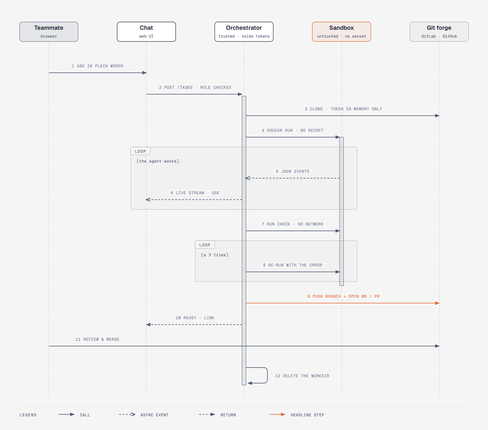

# Architecture

Atelier is one small service, the **orchestrator**, plus a **sandbox image** that it launches on demand.


## Components

| Component | Where | Responsibility |
|---|---|---|
| **Orchestrator** | `orchestrator/` — Node 24, TypeScript run directly (no build step), SQLite. One bounded dependency family: the Vercel AI SDK and its provider packages | HTTP API, accounts and sessions, organizations and roles, task queue, git operations, sandbox lifecycle, the discussion assistant, the project monitor |
| **Assistant** | `orchestrator/src/chat.ts`, `knowledge.ts`, `attachments.ts` | Discuss mode: streams a model's answer (AI SDK) from the organization's provider and key, injects the selected *knowledge*, records which items were used, checks attachments. Never reads the repository and cannot change code |
| **Editor** | `orchestrator/src/editor.ts` | Private editing workspaces on the server: a clone with the git directory outside the tree, a path-safe file API, diff, the sandboxed check, and commit-as-the-person with a push that never forces |
| **AI configuration** | `projects.ts`, `git.ts`, `sandbox/runner.mjs` | Per-project instructions, model, turns and budget given to the agent (and the instructions to the assistant); allow-listed read of the repository's `CLAUDE.md`, rules, skills and agents |
| **Monitor** | `orchestrator/src/monitor.ts`, `health.ts` | Background checks per project: site health every minute (with an SSRF guard) and the last commit of the base branch every five minutes |
| **Vault** | `orchestrator/src/vault.ts` | Encrypts git tokens and model API keys at rest (AES-256-GCM) |
| **Model proxy** | `orchestrator/src/proxy.ts` | The only route out of the sandbox. Identifies the organization from a one-time task token, enforces its budget, allows generation endpoints only and injects that organization's API key |
| **Sandbox** | `sandbox/` — Node 24 slim + the Claude Agent SDK | One disposable container per task. Runs the agent on a copy of the project |
| **Web application** | `web/` — React, TypeScript, Vite, TanStack Router and Query, Tailwind | The interface, built to static files that the orchestrator serves. Overview, conversations, tasks, projects, knowledge, team, integrations, usage, audit log, organization, account and the guide. Chat components come from Vercel AI Elements (vendored). See [web application design](ui-design.md) |

## The life of a task



1. The request goes through authentication and authorization (see [Security](security.md#authorization)).
2. The orchestrator **clones** the project using the organization's git token, held in memory only.
3. It moves `.git` **out of the directory the agent will see**, so the agent cannot plant a hook or config that the orchestrator's git would later execute.
4. It starts the **sandbox** with the working tree mounted and no secret.
5. The agent works; its events (text, tool calls) stream back to the browser live.
6. The orchestrator itself runs the project's **check command** in a network-less container. If it fails, the agent is re-run with the error output (3 attempts by default).
7. It commits, pushes a branch `atelier/<id>` and **opens the MR/PR**. If a *protected path* changed, the title is prefixed `[REVIEW REQUIRED]`.
8. The working directory is deleted.

Only one task runs at a time (a simple in-process queue).

### Follow-up turns

A task is also a conversation. When it is *done*, its author (or an admin) can send a message: the task goes back to *queued* with turn + 1, and the same pipeline runs again but **clones the task branch** instead of the base branch, so the push updates the open merge request. Files and cost accumulate; a failed or cancelled adjustment leaves the previous proposal intact. The team's knowledge selected for the request is given to the agent as context and named in the journal.

## Request routing

Everything an organization owns lives under `/api/orgs/:org/…` (`projects`, `tasks`, `secrets`, `knowledge`, `conversations`, `status`, …). Authentication routes live under `/api/auth/…`. The full list is in [Multi-tenancy](multi-tenancy.md#api).

## Repository layout

```
atelier/
├── CLAUDE.md                       conventions for contributors and AI assistants
├── docker-compose.yml              Portainer / Docker stack (orchestrator + sandbox image)
├── docker-compose.fixtures.yml     adds the fake local git repos used by the demo and tests
├── .env.example · projects.example.json
├── orchestrator/
│   ├── src/index.ts                startup
│   ├── src/app.ts                  HTTP routes and per-organization isolation
│   ├── src/chat.ts                 discussion assistant: provider and model, fake model, streaming
│   ├── src/attachments.ts          validation of attached files (size, count, magic bytes)
│   ├── src/knowledge.ts            knowledge validation and selection under a character budget
│   ├── src/start.ts                starts a task with its conversation; follow-up turns
│   ├── src/editor.ts               editing sessions, safe file API, diff, check, commit
│   ├── src/health.ts, monitor.ts   site health with an SSRF guard; background project status
│   ├── src/access.ts               role → permission table
│   ├── src/auth.ts                 password hashing (scrypt)
│   ├── src/session.ts              cookie sessions (hashed token, sliding expiry)
│   ├── src/ratelimit.ts            login failure limiter
│   ├── src/vault.ts                secret encryption and master key
│   ├── src/projects.ts             project validation, row → pipeline project
│   ├── src/pipeline.ts             clone → agent → check → push → MR/PR
│   ├── src/git.ts                  hardened git, MR (GitLab) and PR (GitHub) creation
│   ├── src/sandbox.ts              runs the agent and the check in Docker
│   ├── src/proxy.ts                model-provider proxy (task token → organization → key)
│   ├── src/tokens.ts               one-time task tokens
│   ├── src/budget.ts               monthly budget check
│   ├── src/invites.ts              invitation token hashing and lifetime
│   ├── src/db.ts                   SQLite schema and queries
│   ├── src/bootstrap.ts            first owner account, one-time import of the legacy config
│   ├── src/config.ts               environment variables
│   ├── src/*.test.ts               tests (node --test)
│   └── src/static.ts               serves web/dist: SPA fallback, strict CSP, no way out of the public folder
├── web/                            the web application (see docs/ui-design.md)
│   ├── src/routes in router.tsx    /o/:org/… pages, guarded by role
│   ├── src/features/<area>/        one folder per page: overview, conversations, tasks, projects, knowledge, guide, team, …
│   ├── src/components/{ui,layout,charts}/   design system, shell, SVG charts
│   ├── src/components/ai-elements/ vendored Vercel AI Elements (chat); components/shadcn/ their primitives
│   └── src/lib/                    API client, queries, formatting, roles, theme
├── sandbox/
│   ├── Dockerfile                  non-root user, no secret
│   └── runner.mjs                  runs the Claude Agent SDK (or the fake agent)
├── fixtures/                       fake projects for the demo and tests
├── docs/                           this documentation, diagram sources and images
└── scripts/
    ├── smoke.sh                    end-to-end test, no AI, no API key (and the UI check if Playwright is installed)
    ├── ui_check.py                 drives the whole web app in a browser (Playwright)
    ├── screenshots.py              retakes the README screenshots from a running demo
    ├── seed-demo.mjs               gives the demo realistic history
    ├── demo.sh                     local demo with three fake projects
    ├── fixtures.sh                 builds the fake local git repositories
    └── diagrams.sh                 regenerates docs/img from docs/diagrams
```

## Diagrams

The images in `docs/img/` are generated (PNG and SVG) from the diagram-design HTML/SVG sources in `docs/diagrams/` with `scripts/diagrams.sh` (needs `pip install playwright` and Chrome). Edit the source, regenerate, commit both.
