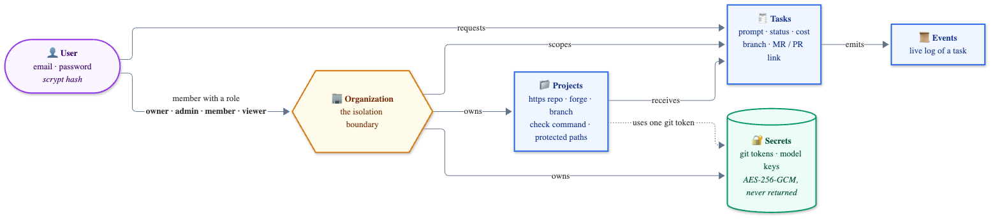

# Multi-tenancy

Several **users** grouped in **organizations**. Each organization owns its projects, secrets and history. A person in one organization never sees, launches or costs anything to another.

**Status:** steps U1–U6 are done: accounts, sessions, roles, per-organization tasks, encrypted secrets, projects, per-organization model keys with task tokens and a monthly budget, organization creation, members and invitations — each with its API **and** its web UI. What remains is SSO ("sign in with GitLab / GitHub", OIDC). See the [roadmap](roadmap.md).

## Data model



The **organization is the isolation boundary**. Every task, project and secret carries an `org_id`, and every query filters on the organization taken from the session — see [Security → Authorization](security.md#authorization).

## Decisions

| Decision | Choice | Why / when to revisit |
|---|---|---|
| Authentication | **Local accounts**: e-mail + password (scrypt), cookie session | No dependency. OIDC and "sign in with GitLab/GitHub" come with U6 and later |
| Database | **SQLite kept** | Enough for a self-hosted instance or a small SaaS. PostgreSQL only when several orchestrator instances or volume require it |
| Tenancy model | **Organization → members, projects, secrets, tasks** | Standard; avoids reshaping the schema later |
| Roles | `owner` · `admin` · `member` · `viewer` | See the matrix below |
| Secrets | **Encrypted at rest** (AES-256-GCM), master key in `ATELIER_MASTER_KEY` | No external KMS yet |
| First account | Created on first start (`ATELIER_BOOTSTRAP_EMAIL` + `ATELIER_PASSWORD`) | |
| Sign-up | **Invitation only** | No open sign-up until quotas and stronger isolation exist |
| Creating organizations | **Any signed-in user**, up to 10 each; they become its owner | Revisit if organizations must be provisioned centrally |
| Invitations | **A single-use link, shown once** to the inviter; nothing is e-mailed | No mail server to run or secure. Add e-mail delivery later if wanted |

## Roles

| Action | viewer | member | admin | owner |
|---|:-:|:-:|:-:|:-:|
| Read tasks, logs and projects | ✅ | ✅ | ✅ | ✅ |
| Launch tasks, cancel **your own** | | ✅ | ✅ | ✅ |
| Cancel anyone's task | | | ✅ | ✅ |
| Manage projects | | | ✅ | ✅ |
| Manage secrets (git tokens, model keys) | | | ✅ | ✅ |
| Read and set the monthly model budget | | | ✅ | ✅ |
| Invite, change roles, remove members | | | ✅ (roles up to their own) | ✅ |
| Touch an owner | | | | ✅ |

Privilege escalation is blocked: you can only grant a role at or below your own, only an owner can modify or remove an owner, and the **last owner can be neither demoted nor removed**.

Secrets are **never returned** by the API after creation — only a label and a 4-character hint.

## API

All organization routes are under `/api/orgs/:org`. Every route except login and `accept-invite` requires a session cookie. Anything that belongs to another organization answers **404**; a role that is too low answers **403**.

```
# account
POST   /api/auth/login            { email, password }            → session cookie
POST   /api/auth/logout
POST   /api/auth/password         { current, next }              → revokes other sessions
POST   /api/auth/accept-invite    { token, password? }           public: creates the account, or joins a signed-in user whose e-mail matches
GET    /api/me                                                    → user (id, email, name) + organizations + roles
PATCH  /api/me                    { name }                       display name (80 characters, or null)
GET    /api/me/activity                                           what you did, across organizations
GET    /api/me/sessions                                           active sessions: browser, IP, last use, which is current
DELETE /api/me/sessions/:id                                       revoke one of YOUR sessions
POST   /api/me/sessions/revoke-others

# organization
POST   /api/orgs                  { name }                       any signed-in user → becomes owner
GET    /api/orgs/:org                                             admin+  → name, budget, month spend
PATCH  /api/orgs/:org             { name?, budgetUsdMonth? }      admin+  (budget: a number ≥ 0, or null for no cap)
DELETE /api/orgs/:org             { confirm: "<exact name>" }     owner   refused while tasks run; deletes everything it owns

# people
GET    /api/orgs/:org/members                                     admin+
PATCH  /api/orgs/:org/members/:userId    { role }                 admin+  (see the privilege rules)
DELETE /api/orgs/:org/members/:userId                             admin+
GET    /api/orgs/:org/invitations                                 admin+  (never the link)
POST   /api/orgs/:org/invitations { email, role }                 admin+  → returns the link token ONCE
DELETE /api/orgs/:org/invitations/:id                             admin+

# projects and integrations
GET    /api/orgs/:org/projects                                    viewer+
POST   /api/orgs/:org/projects                                    admin+
PATCH  /api/orgs/:org/projects/:id                                admin+
DELETE /api/orgs/:org/projects/:id                                admin+
POST   /api/orgs/:org/projects/:id/verify                         admin+  git ls-remote with the project's token, no clone
GET    /api/orgs/:org/secrets                                     admin+  (never the value) + which projects use each, last use
POST   /api/orgs/:org/secrets     { kind, provider?, label, value }
PATCH  /api/orgs/:org/secrets/:id { label?, value? }              admin+  rotate the value, keeping the id
DELETE /api/orgs/:org/secrets/:id                                 409 if a project uses it

# tasks
GET    /api/orgs/:org/tasks?status=&project=&user=&q=&from=&to=&limit=&offset=
                                                                  viewer+  → { items, total, limit, offset }
POST   /api/orgs/:org/tasks       { project, prompt }             member+
GET    /api/orgs/:org/tasks/:id                                   requester, project name, timing, files changed
GET    /api/orgs/:org/tasks/:id/events                            live stream (SSE)
POST   /api/orgs/:org/tasks/:id/cancel                            own task, or admin+
POST   /api/orgs/:org/tasks/:id/retry                             member+  a new task with the same request

# tracking
GET    /api/orgs/:org/stats?days=30                               viewer+  totals, success rate, average duration, per day, per project
GET    /api/orgs/:org/usage?days=30                               admin+   spend and calls per day, member, provider; budget and projection
GET    /api/orgs/:org/audit?action=&user=&q=&from=&to=&limit=&offset=
                                                                  admin+   who did what; add format=csv to export
```

## Upgrading from the single-user version

On first start with an empty user table, Atelier creates the *Default* organization and its owner. Existing tasks are attached to it. Then, **once** (a flag in the database), the legacy configuration is imported into the Default organization: `PROJECTS_JSON` / `projects.json` become projects, `GIT_TOKEN*` and `*_API_KEY` become encrypted secrets, and existing tasks are re-pointed at their new project rows. After that, editing `PROJECTS_JSON` has no effect — manage everything through the API.

## Implementation steps

| Step | Content | Status |
|---|---|:-:|
| **U1** | Schema (users, organizations, memberships, sessions), scrypt hashing, owner created at startup | ✅ |
| **U2** | Login/logout, cookie sessions, `Origin` check, rate limiting, password change; replaces Basic auth | ✅ |
| **U3** | Organizations, roles, per-organization tasks, routes under `/api/orgs/:org`, isolation test suite | ✅ |
| **U4** | Encrypted secrets, projects in the database, one-time import of the legacy config | ✅ |
| **U5** | One-time task token and per-organization model keys in the proxy, monthly budget | ✅ |
| **U6a** | Organization creation, members, invitations: API, privilege rules, tests | ✅ |
| **U6b** | Web UI: members, invitations (copy the link), projects, secrets, budget, accept-invite page, organization picker | ✅ |
| later | OIDC and GitLab / GitHub OAuth sign-in | planned |

### How U5 works

Each task receives a **one-time task token** in place of an API key. The proxy resolves `token → task → organization`, refuses the call if the organization's monthly budget is spent (402), then injects the organization's **own** key for that provider (the most recent `provider_key` secret). An organization without a key for a provider gets a 403 — there is no fallback to another organization's key or to an environment variable. The token is revoked when the task ends.

The budget is measured on the cost the agents report for each task, summed over the current UTC month. It is a coarse control: a running task can overshoot by up to its own `MAX_BUDGET_USD`. Live token metering in the proxy is not built yet.

### How invitations work

An admin creates an invitation for an e-mail address and a role (at most their own). The API returns a link token **once**; only its SHA-256 is stored, and listing invitations never shows it. The admin hands the link over by whatever channel they like — **nothing is sent by e-mail**.

The recipient opens it and either **creates an account** (the e-mail comes from the invitation, they choose a password) or, if the address already has an account, **signs in first** and accepts. A signed-in user whose e-mail differs from the invitation is refused, so a leaked link alone is not enough. The link works once and expires after 7 days; unknown, expired and used links all answer the same 404. A new invitation for the same organization and address replaces the previous one.

## The web UI

Everything above is reachable from the browser (the UI text is in French). Admins and owners get a **Settings** tab:

| Card | What you can do |
|---|---|
| Members | See everyone, change roles (only roles you may grant are offered), remove a member |
| Invitations | Create a link (shown once, with a **Copy** button), see pending ones, revoke |
| Projects | List, add (repository, branch, check command, protected paths, git token), delete |
| Secrets | Store git tokens and model keys (the value is never shown again), delete |
| Budget | See this month's spend, set or clear the monthly cap |

Everyone gets the organization picker, **New organization** and **My account** (password change). Opening an invitation link (`/?invite=…`) shows a page to create the account — or to join with the account you are signed in with. Destructive actions ask for a second click instead of a browser dialog. Buttons the server would refuse are greyed out, but the server is what decides.

