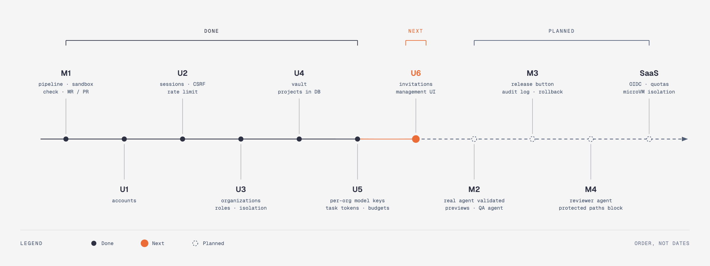

# Roadmap

| Milestone | Content | Status |
|---|---|:-:|
| **M1** | Pipeline: chat, sandbox, check and fix loop, branch, MR/PR. Multi-project, multi-forge, model proxy | ✅ |
| **U1–U5** | Accounts, sessions, organizations and roles, encrypted secrets, projects in the database, per-organization model keys with task tokens and a monthly budget — see [Multi-tenancy](multi-tenancy.md) | ✅ |
| **U6a** | Organization creation, members and invitations (API) | ✅ |
| **U6b** | Web UI for organizations, members, invitations, projects, secrets and the budget; later OIDC and GitLab/GitHub sign-in | next |
| **M2** | Real agent validated end to end, preview per merge request, QA agent with screenshots | planned |
| **M3** | Release button and rollback, immutable audit log | planned |
| **M4** | Independent reviewer agent, protected paths that block instead of flag, spend ceilings, kill switch | planned |
| **SaaS** | See below | planned |

## Toward a multi-tenant SaaS

Going from a team tool to a public platform is not an extension of M1: **the threat model changes**. You stop running a trusted team's code and start running code for customers who do not know each other.

| Topic | Today | SaaS target |
|---|---|---|
| Authentication | Local accounts and sessions ✅ | + SSO (OIDC), "sign in with GitLab / GitHub" |
| Tenants | Organizations, roles, invitations, isolated tasks, projects and secrets ✅ (API; UI next) | + per-organization audit trail |
| Git access | A token stored per organization ✅ | **OAuth / GitHub App / GitLab OAuth** per organization, minimal and revocable scopes |
| Model keys | Per organization, encrypted, injected by the proxy from a task token ✅ | + a platform key that is re-billed |
| Database | SQLite | PostgreSQL |
| Execution | Docker through a mounted socket | **gVisor or Firecracker**, a sandbox service with no Docker socket, on machines dedicated to agents |
| Agent network | Internal network + proxy | Same, plus **per-organization egress rules** and a caching package registry |
| Cost control | Ceiling per task + monthly budget per organization (on reported cost) ✅ | Live token metering in the proxy, quotas and billing |
| Concurrency | One task at a time | Worker pool, per-organization queues, fairness |
| Traceability | Events per task | Immutable audit log: who asked, which diff, who merged |

Already aligned with that target: secrets are isolated from the agent, forges are abstracted, projects are data rather than code, and the orchestrator is the only trusted zone.
