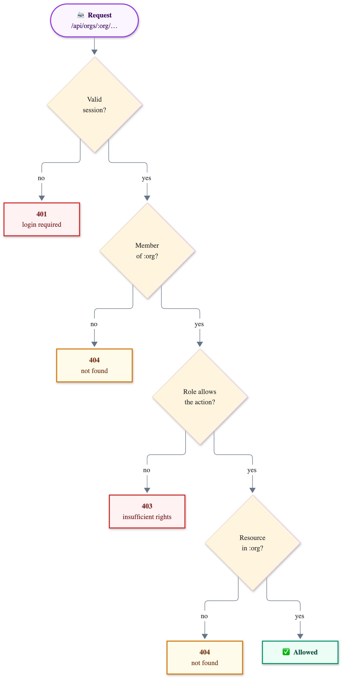
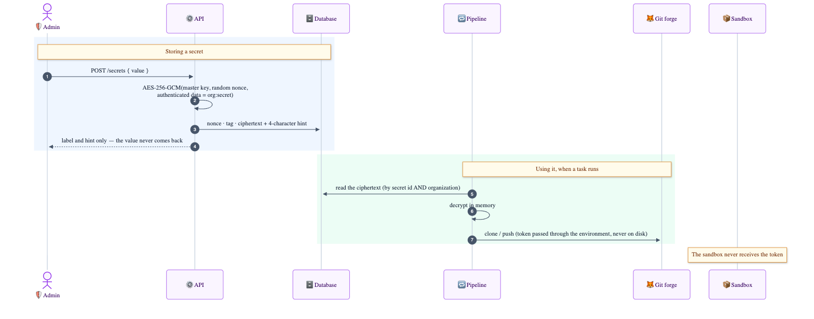

# Security

## Principle

**The agent never holds a power it could abuse.** Everything sensitive — model API keys, git tokens, pushing, opening merge requests — lives in the orchestrator, which is ordinary code the agent cannot modify. The agent only gets what it needs to edit files inside its own container.

| The agent can… | The agent cannot… |
|---|---|
| read and edit the files of a disposable copy of the project | see a git token, an API key or any production secret |
| run commands *inside its container* | reach the Internet (internal-only network) |
| talk to the model through the orchestrator's proxy | push, merge or deploy |
| | touch the `.git` directory (kept out of its sight) |

The sandbox runs as a non-root user with `--cap-drop ALL`, `no-new-privileges`, 1 CPU, 1 GiB of memory and a 512-process limit. **This is container-grade isolation, not virtual-machine isolation** — see the limitations below.

## Authorization

Every request under `/api/orgs/:org/…` goes through the same decision, in this order:

- The organization comes from the URL but is **never trusted**: the role is looked up for *this user in this organization*.
- A non-member gets **404**, never 403, so the existence of an organization is not revealed.
- Resources are fetched by **(id, organization)**, never by id alone. Guessing another organization's exact task id, project id or secret id yields 404.
- The permission table is a single file: [`orchestrator/src/access.ts`](../orchestrator/src/access.ts).

This is covered by `isolation.test.ts` and `resources.test.ts`, which start a real HTTP server with several users in two organizations.

## Secrets

- **AES-256-GCM** with a random nonce per secret. The organization id **and** the secret id are *authenticated data*: a ciphertext copied to another organization or another secret fails to decrypt.
- The master key comes from `ATELIER_MASTER_KEY`, or is generated next to the database (mode `600`) on first start. **Losing it makes every secret unreadable — back it up separately from the database.**
- The API never returns a secret, only a label and a 4-character hint. Listing queries do not even select the ciphertext column.
- Tokens are passed to git through `GIT_CONFIG_*` environment variables: they appear in no command line, no URL, no `.git/config` and no file the agent can read.

## Design choices that each close an attack

- **`.git` lives outside the mounted directory.** Otherwise the agent could write a `.git/config` (`core.fsmonitor`, `core.sshCommand`) or a hook that the orchestrator's git — which carries the token — would execute. The repository is cloned with `--separate-git-dir`, git is always called with explicit `--git-dir/--work-tree`, `core.hooksPath=/dev/null` and `core.fsmonitor=false`, and any `.git` the agent creates is removed.
- **The orchestrator runs the checks itself**, without network and outside the agent. The agent's claim that "the tests pass" is never trusted.
- **Model keys stay in a proxy.** The sandbox receives a dummy key; the proxy allows only generation routes and adds the real one.
- **Repositories must be `https://` URLs without embedded credentials**, optionally restricted to an allowlist of hosts (`ATELIER_GIT_HOSTS`). Local paths and exotic schemes would let a user read files from the host. Branch names cannot start with `-` or contain `..`, so they cannot be mistaken for git options.
- **Protected paths.** If the diff touches a project's `protectedPaths` (migrations, CI config…), the MR/PR is titled `[REVIEW REQUIRED]` and says so.
- **CSRF.** Session cookies are `HttpOnly; SameSite=Strict`, and state-changing requests are rejected when `Origin` does not match the host.
- **Sessions.** 256-bit random token; only its SHA-256 is stored, so a database leak cannot be replayed. Sliding 7-day expiry, revoked on logout and on password change.
- **Passwords.** scrypt with a per-user salt, parameters stored with the hash, bounded length, 8-character minimum. Login runs a hash even for unknown accounts and returns the same message, so timing and wording do not reveal which accounts exist. Failed logins are rate-limited per IP and per e-mail.

## Known limitations

Read these before exposing the service.

- **The Docker socket is mounted into the orchestrator, which is equivalent to root on the host.** Acceptable for a trusted team on a dedicated machine; **not acceptable for a multi-tenant SaaS** with mutually untrusting customers. A filtering socket proxy helps; microVM isolation (gVisor/Firecracker) fixes it properly. See the [roadmap](roadmap.md).
- **Model API keys are still global** (environment variables) and shared by every organization, until step U5 moves them to per-organization secrets. The proxy cannot yet tell which organization a call is for, nor meter spend.
- **No invitations and no organization-creation API yet** (step U6): in practice only the default organization exists. Organizations, projects and secrets can be managed through the API; the web UI does not expose them yet.
- **Rate limiting is in memory**: it resets on restart and does not span several instances.
- **No egress filtering of the orchestrator.** A user who may create projects can make it clone from any allowed `https` host; set `ATELIER_GIT_HOSTS` to restrict it.
- **The sandbox has no Internet**, so the agent cannot `npm install`, and its image contains only Node. Projects that need dependencies need a prepared image or a registry proxy (not built).
- **Spend is only bounded per task** (`MAX_BUDGET_USD`, turn and time limits). Cap the keys in the provider's console too.
- **One task at a time.**
- **The real Claude agent and real GitLab/GitHub calls have not been exercised yet**; they are implemented but verified only through the fake agent and local git repositories.
- Serve it behind **HTTPS**. Set `TRUST_PROXY=1` behind a reverse proxy so cookies are marked `Secure` and client IPs are read correctly.
